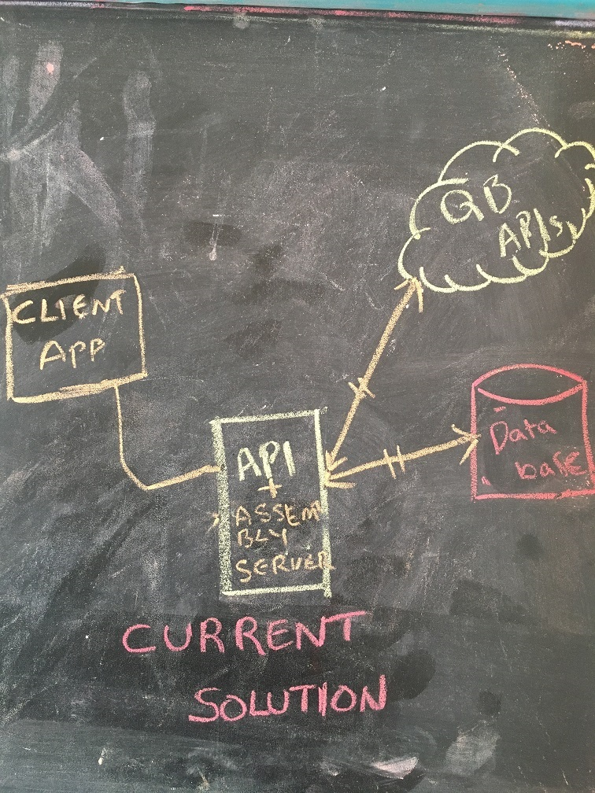
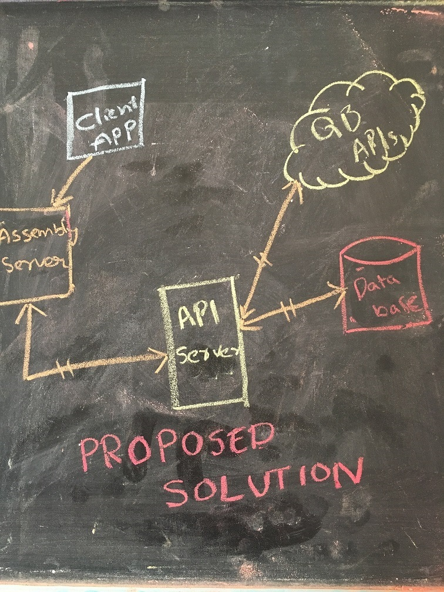

# Solution at a glance 

You can find the Current and Proposed solutions of this applicaiton in bleow section. I will focus on these improvements in near future.

## Current Solution ##
The current solution includes Client and Server apps communication/integration model

* API + Assembley Server 
    * LoopbackJS is used as API + Assembley server
    * API Server used to communicate with Mongo database. 
    * Seperate route is created for Data Sync process
    * Session managment and security is implemented in the same API + Assembley server
     
 * Client application 
    * React/Redux used to develop Front-End application. 
    * The generated bundle can be injected to Assembly server to server clients.
    * This can also be developed/tested indepedently in development mode without having dependencies on Server side (Using webpack)

## Proposed Solution ##

* API Server 
    * LoopbackJS is used as API server
    * API Server can be used as Integration gateway between multiple eco-systems. 
      * Used do CURD options on MongoDB database
      * Can be used as a proxy for QuickBooks API as well.

 * Assembly Server 
    * ExpressJS can be used as Assembly Server
    * Can be used to assemble differnt layers like Front-End app, API server etc., 
    * This also can be used for managment, Authentication and Authentication (may be using JWT) etc.,

 * Client application 
    * React/Redux used to develop Front-End application. 
    * The generated bundle can be injected to Assembly server to server clients.
    * This can also be developed/tested indepedently in development mode without having dependencies on Server side (Using webpack)

The proposed solution includes API server, Assembly Server and Client apps communication/integration model

